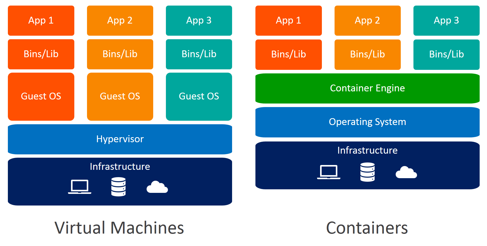

# DOCKER COMMANDS 

- Show Docker version	- `docker version`
- Show system info	- `docker info`
- Check disk usage	- `docker system df`

- List images	- `docker images`
- Build image - `	docker build -t myapp .`
- Pull image from registry -` docker pull nginx`
- Remove image -	`docker rmi <image>`
- Tag image -	`docker tag image_id repo:tag`

- Run container -	`docker run -d -p 8080:80 nginx`
- Run interactively -	`docker run -it ubuntu bash`
- List running containers - 	`docker ps`
- List all containers	- `docker ps -a`
- Stop container	- `docker stop <container>`
- Start container - `docker start <container>`
- Remove container -	`docker rm <container>`
- Force remove -	`docker rm -f <container>`
- Rename container -	`docker rename old new`

- View logs -	`docker logs <container>`
- View config -	`docker inspect <container or image>`
- Execute command in container -	`docker exec -it <container> bash`
- Check resource usage -	`docker stats`
- Check port mappings -	`docker port <container>`
- 
- List volumes -	`docker volume ls`
- Create volume -	`docker volume create myvol`
- Inspect volume -	`docker volume inspect myvol`
- Remove volume -	`docker volume rm myvol`
- Prune unused volumes -	`docker volume prune`

- List networks -	`docker network ls`
- Inspect network	- `docker network inspect <network>`
- Create network -	`docker network create mynet`
- Connect container to network -	`docker network connect mynet container_name`
- 
- Remove all stopped containers -	`docker container prune`
- Remove unused images -	`docker image prune`
- Remove all unused data -	`docker system prune -a`
- 
- DOCKER-COMPOSE
- Start services -	`docker-compose up -d` 
- Stop services -	`docker-compose down`
- View logs -	`docker-compose logs`
- Build services -	`docker-compose build`

---

## CONTAINERS VS VM



| Component           | Virtual Machine                             | Container                                   |
|---------------------|---------------------------------------------|---------------------------------------------|
| Virtualization Type | Hardware-level virtualization via hypervisor| OS-level virtualization via namespaces       |
| Guest OS            | Full OS per VM                              | No guest OS; shares host OS kernel           |
| Startup Time        | Minutes (boots entire OS)                   | Seconds (starts an isolated process)         |
| Resource Usage      | Heavyweight (requires more RAM, CPU)        | Lightweight (minimal overhead)               |
| Isolation           | Strong (hardware boundary)                  | Medium (process isolation)                   |
| Portability         | Lower (OS-dependent)                        | High (OS-agnostic within same kernel)        |
| File Size           | GBs (entire OS image)                       | MBs (only app and dependencies)              |

---

## DOCKER ARCHITECTURE
Docker uses a client-server architecture to run and manage containers. It’s built around lightweight OS-level virtualization using Linux features like namespaces and cgroups.Docker uses a client-server architecture to run and manage containers. It’s built around lightweight OS-level virtualization using Linux features like namespaces and cgroups.

**Component**
- Docker CLI	The command-line tool (docker) that users interact with. Sends requests to Docker Daemon via REST API.
- Docker Daemon (dockerd)	The background service that manages Docker objects: containers, images, volumes, etc.
- Docker REST API	Interface through which CLI and tools communicate with the daemon.
- Container Runtime	Docker uses runc by default (complies with OCI). It’s responsible for running containers.
- Docker Engine	Umbrella term for the Docker Daemon + CLI + APIs that run and manage containers.
- Linux Kernel Features	Uses namespaces (for isolation) and cgroups (for resource control).
- `containerd`	Industry-standard container runtime that Docker uses internally
- `runc	Low-level` OCI runtime to spawn containers
- `overlay2`	Default storage driver for Docker (Union FS for layers)


**Linux Kernel Features Behind Docker**
- Namespaces	Isolate container processes (PID, NET, UTS, MNT, IPC, USER)
- cgroups	Limit CPU, memory, I/O usage for containers
- UnionFS	Layered filesystem used by Docker images (e.g., OverlayFS)
- Capabilities	Drop unnecessary root privileges for better security


## DOCKER IMAGE, CONTAINER, DOCKERFILE
Docker Image - A Docker image is a read-only template that contains the application code, runtime, libraries, environment variables, and configurations required to run an application. `docker build -t myflaskapp .`

Docker Container - A Docker container is a running instance of a Docker image. It’s a lightweight, standalone, and executable software package that runs your application in an isolated environment. `docker run -d -p 5000:5000 myflaskapp`

Dockerfile - A Dockerfile is a script with a set of instructions on how to build a Docker image. It defines the base image, copies files, installs dependencies, and sets environment configurations.

```dockerfile
# Use base image
FROM python:3.11

# Set working directory
WORKDIR /app

# Copy files
COPY requirements.txt .
RUN pip install -r requirements.txt
COPY . .

# Run the app
CMD ["python", "app.py"]

```
---

## DOCKER LAYERS
A Docker image is made up of a series of layers, where each layer represents an instruction in the Dockerfile (like FROM, COPY, RUN, etc.).
Each layer
- Is immutable (unchangeable).
- Is cached and reused in future builds if unchanged.
- Stacks on top of previous layers to create the final image.

Benefits:
Caching: Docker caches each layer. If the code or files in a layer don’t change, Docker reuses the cached layer.
Efficiency: Layers are shared across images — if multiple images use the same base image (like python:3.11), Docker stores it only once.
Smaller Updates: Only the changed layers are rebuilt and pushed to registries.

Commands like COPY, ADD, or RUN invalidate cache if inputs or order change.


## MULTI-STAGE BUILDS
- Multi-stage build uses multiple FROM statements in one Dockerfile.
- First stage builds the code or binaries.
- Final stage copies only necessary files/artifacts.
- Avoid shipping build-time dependencies in the production image.
- This reduces image size, removes sensitive files, and keeps only what’s needed in production.

- You compile in one stage (using full toolchain).
- Then copy only the output (binaries/files) into a clean, minimal final image.
```dockerfile
# -------- Stage 1: Build Stage --------
FROM golang:1.21 AS builder
WORKDIR /app
COPY . .
RUN go build -o main .

# -------- Stage 2: Production Image --------
FROM alpine:latest
WORKDIR /app
COPY --from=builder /app/main .
CMD ["./main"]

```
---

## DOCKER NETWORK
Docker networking provides communication between containers, between containers and the host machine, and with the outside world.
Each container gets a unique IP address, Its own network namespace and Controlled port mappings

There are 5 types of network mode in docker 
1. Bridge
- Bridge (default for standalone containers) Creates an internal network on the host.
- Containers on the same bridge network can communicate.
- The host and external systems cannot reach containers directly unless ports are expose
- create: `docker network create --driver bridge my-bridge`, USE: `docker run --network my-bridge nginx`

2. Host
- The container shares the host machine’s network stack.
- No network isolation between host and container.
- No need for -p to publish ports — container uses host ports directly
- `docker run --network host nginx`

3. Overlay
- Used with Docker Swarm or multi-host clusters.
- Creates a virtual network spanning multiple Docker hosts.
- Uses VXLAN tunneling for cross-host container communication.
- `docker network create --driver overlay my-overlay`

4. None
- The container has no network interface.
- Used for containers that don’t require networking or for full custom network stacks.
- `docker run --network none alpine`

5. Macvlan
- Assigns containers a real MAC address and IP from the LAN.
- Bypasses NAT — containers appear like physical devices on the network.
- Requires configuring a physical network interface on the host.
- `docker network create -d macvlan --subnet=192.168.1.0/24 --gateway=192.168.1.1 -o parent=eth0 my-macvlan`

---

## DOCKER VOLUMES
Containers are ephemeral by design — once deleted, their filesystem is lost. Docker volume is a persistent storage mechanism managed by Docker, used to store data outside of the container’s writable layer, so that data persists across container restarts or removals. it provides Data durability, Sharing data between containers, Storing configuration files, logs, or user data.

There are 3 types of docker volumes

1. Named Volumes
- Created and stored under Docker’s storage directory (/var/lib/docker/volumes)
- Docker handles the location and management.
- More portable and suitable for production use.
- Create: `docker volume create my-volume`, USE: `docker run -v my-volume:/data ubuntu`

2. Anonymous Volumes
- Created automatically by Docker when you mount a volume without a name.
- Hard to reference or reuse later.
- `docker run -v /data ubuntu`

3. Bind Mounts
- Mounts a specific host path into the container.
- Not managed by Docker — offers more control, but less portability.
- `docker run -v /home/user/app:/app ubuntu`

---

## DOCKERFILE
A Dockerfile is a text-based script that contains a set of instructions on how to build a Docker image.
It defines everything needed for your app:
- Base OS
- Dependencies
- App files
- Build steps
- Environment variables
- Default commands
Docker reads this file when you run docker build, and each instruction creates a layer in the image.

#### Dockerfile Attributes

| **Instruction** | **Description / Purpose**                                                                                | **Example Usage**                                |
| --------------- | -------------------------------------------------------------------------------------------------------- | ------------------------------------------------ |
| `FROM`          | Sets the **base image** for the build. Required as the first instruction.                                | `FROM ubuntu:22.04`                              |
| `RUN`           | Executes shell commands inside the image during build. Creates a new layer.                              | `RUN apt-get update && apt-get install -y nginx` |
| `CMD`           | Sets the **default command** to run when the container starts. Can be overridden by CLI.                 | `CMD ["npm", "start"]`                           |
| `LABEL`         | Adds metadata to the image. Useful for versioning, authorship, etc.                                      | `LABEL maintainer="you@example.com"`             |
| `EXPOSE`        | Documents the **port** the container will listen on. (Does not publish the port.)                        | `EXPOSE 8080`                                    |
| `ENV`           | Sets **environment variables** in the container.                                                         | `ENV NODE_ENV=production`                        |
| `ADD`           | Copies files and directories to the container, with support for remote URLs and archive auto-extraction. | `ADD myapp.tar.gz /app/`                         |
| `COPY`          | Copies files/directories to the container (without extraction). More predictable than `ADD`.             | `COPY . /app/`                                   |
| `ENTRYPOINT`    | Configures a **fixed command** that always runs. Useful for defining a wrapper script.                   | `ENTRYPOINT ["python", "app.py"]`                |
| `VOLUME`        | Creates a mount point for a **volume** inside the container.                                             | `VOLUME ["/data"]`                               |
| `USER`          | Sets the **username or UID** to run subsequent commands (good for security).                             | `USER appuser`                                   |
| `WORKDIR`       | Sets the **working directory** for subsequent instructions.                                              | `WORKDIR /app`                                   |
| `ARG`           | Declares a **build-time variable**. Used with `--build-arg`.                                             | `ARG VERSION=1.0`                                |
| `ONBUILD`       | Adds a trigger instruction to be executed when the image is used as a base for another build.            | `ONBUILD COPY . /app`                            |
| `STOPSIGNAL`    | Defines the system signal to stop the container.                                                         | `STOPSIGNAL SIGTERM`                             |
| `HEALTHCHECK`   | Defines how Docker checks the health of a running container.                                             | `HEALTHCHECK CMD curl -f http://localhost/       |
| `SHELL`         | Changes the default shell used in `RUN` (default is `/bin/sh -c`).                                       | `SHELL ["powershell", "-command"]`               |
| `.dockerignore` | (Not an instruction) File used to exclude files from being copied to the image (like `.gitignore`).      | `.dockerignore → node_modules, .git/`            |


#### Dockerfile sample 
```dockerfile
# ---- Stage 1: Builder ----
FROM node:18-alpine AS builder

# ARG used at build time
ARG NODE_ENV=production
ENV NODE_ENV=${NODE_ENV}

# Label for metadata
LABEL maintainer="you@example.com"
LABEL stage="builder"

# Set working directory
WORKDIR /app

# Copy package files and install deps
COPY package*.json ./
RUN npm install --only=production

# Copy the full app source
COPY . .

# Optional: run build step if app has one
RUN npm run build

# ---- Stage 2: Final image ----
FROM node:18-alpine

# Set environment variable
ENV NODE_ENV=production

# Set working directory
WORKDIR /app

# Use a specific user for security
RUN addgroup -S appgroup && adduser -S appuser -G appgroup
USER appuser

# Copy built app from builder stage
COPY --from=builder /app ./

# Expose app port
EXPOSE 3000

# Healthcheck for container readiness
HEALTHCHECK --interval=30s --timeout=5s --start-period=10s --retries=3 \
  CMD wget --no-verbose --tries=1 --spider http://localhost:3000 || exit 1

# Create a volume (optional)
VOLUME ["/app/logs"]

# Default command
CMD ["node", "server.js"]

# Entrypoint for customization (optional)
# ENTRYPOINT ["node"]

```
---

## DOCKER COMPOSE
Docker Compose is a tool for defining and running multi-container Docker applications using a single YAML file (docker-compose.yml).
Instead of running each container manually, you can define:
- Services (containers)
- Networks
- Volumes
- Build instructions
- Environment variables


**Tips & Best Practices**
- Use named volumes instead of bind mounts in production.
- Use depends_on + healthcheck for smarter service boot sequencing.
- Add .env file to keep secrets/configuration out of code.
- Use docker-compose.override.yml for environment-specific changes.
- Use build.context and build.dockerfile for better control.

#### composefile with all arguments
```bash
services:
  web:
    container_name: my-web-container  # Custom container name
    build:
      context: ./web  # Build directory
      dockerfile: Dockerfile  # Custom Dockerfile name
      args:
        - NODE_ENV=production  # Build-time argument
    image: my-web-app:latest
    ports:
      - "8080:80"  # Host:Container
    environment:
      - APP_ENV=production
      - DEBUG=false
    env_file:
      - ./web/.env  # External env file
    volumes:
      - web-data:/var/www/html  # Named volume
      - ./web/static:/static  # Bind mount
    depends_on:
      - db
    networks:
      - frontend
    restart: unless-stopped
    command: ["npm", "start"]
    entrypoint: ["docker-entrypoint.sh"]
    working_dir: /var/www/html
    stdin_open: true
    tty: true
    healthcheck:
      test: ["CMD", "curl", "-f", "http://localhost"]
      interval: 30s
      timeout: 10s
      retries: 5
      start_period: 10s
    labels:
      com.example.description: "Web frontend"

  db:
    image: postgres:15
    container_name: db-container
    ports:
      - "5432:5432"
    environment:
      POSTGRES_DB: mydb
      POSTGRES_USER: admin
      POSTGRES_PASSWORD: secret
    volumes:
      - db-data:/var/lib/postgresql/data
      - ex-vol:/test
    networks:
      - backend
      - proxy
    restart: on-failure

  redis:
    image: redis:7
    container_name: redis-container
    ports:
      - "6379:6379"
    networks:
      - backend
      
volumes:
  db-data:
  web-data:
  ex-vol:
    external: true

networks:
  frontend:
    driver: bridge
  backend:
    driver: bridge
  proxy:
    external: true

```
---

## DOCKERIGNORE
- `.dockerignore` is a text file that tells Docker which files and folders to exclude from the build context when you run `docker build`.

```dockerfile
node_modules
.git
Dockerfile
docker-compose.yml
.env
*.log
*.tmp
*.bak
build/
coverage/
__pycache__/
*.pyc
```

---