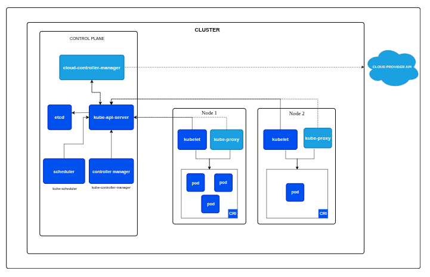

# K8s Architecture

- K8s Architecture consist of two parts, the CONTROL PLANE (master) and the WORKER NODE (slave)
- control plane makes global decisions about the cluster and used to manage the whole kubernetes environment
- worker nodes are worker nodes that work to run the work, basically their goal is to run the required workload
- if control plane is brain then worker node is basically muscle 
- both consist of different set of components.

# CONTROL PLANE 
- control plane makes global decisions about cluster like scheduling, detecting changes in cluster, keeping everything in desired state etc
- it consists of 5 components

1. **KUBE-API SERVER**
- kube-api server exposes the kubernetes api which is front end for the control plane, the only open door for communication
- every component and we all talk directly to api server, be it any kubectl command or any component reporting their status 
- it does not store any data, its stateless. every data is stored in etcd
- it can be scaled horizontally (running multiple instances) for HA
- there are 3A of api server, Authentication, Authorization, Admission control
- Authentication simply verifies whether the client is authorized to access through certificates or tokens 
- Authorization checks if the authenticated identity has permission for the requested action through RBAC ,etc
- **Admission control decides** whether this request is to be modified or rejected
- **mutating admission control** can modify any request like injecting sidecars or adding default resource quotas etc 
- **validating admission control** can allow or reject the request based on the specification like some image is not allowed 
- so even if you are allowed to run a pod, if you are running a banned image defined in validating admission control, your request fails

2. **ETCD**
- its the single source of truth of kubernetes. highly available, consistent key value store 
- it stores all the cluster data like nodes, running pods, secrets, etc everything is stored here
- all kubernetes objects like pods, deployments, services, configmaps, secrets, current and desired state of all resources, Persistent volume claims, network policies, rbac rules etc are stored in etcd 
- other data like pod logs or metric data etc are not stored in etcd
- etcd uses the **Raft consensus algorithm**

3. **KUBE-SCHEDULER**
- its sole purpose is to just find the best worker node for a pod to run on
- it does not start the pod, it just decides the best node for a pod using algorithms and conditions
- the decision involves 2 step where it filter out the feasible nodes which meets the requirement to run a pod
- after that it scores all the feasible nodes to find the most optimal node for the pod  
- **Filtering** is done based on conditions defined in manifest like NodeSelector, NodeAffinity, Taints/Tolerations, Resources, Volume, Port, PodAffinity/Anti-Affinity, once done it outputs a list of feasible nodes
- **Scoring** is done via weighted scoring system where multiple plugins result in a final score of feasible nodes like LeastAllocated, ImageLocality etc factors.
- when there is a tie between multiple nodes score, it simply chooses the lowest alphabetical node name

4. **KUBE-CONTROLLER-MANAGER**
- it is like a manager who watches specific resource types and ensure that current state matches the desired state
- it runs as a single binary but contains multiple independent controllers
- this simply gives the k8s its self-healing properties
- you can create a standalone pod without this but you can't do main things without it

- **Deployment Controller** manage deployments and their rollout strategies
- **ReplicaSet Controller** ensure the correct number of pod replicas are running 
- **StatefulSet Controller** manage stateful applications with stable networking and storage
- **DaemonSet Controller** ensures every node run the specified pod
- **Node Controller** monitor node health and manage node lifecycle like node monitoring and eviction
- **Endpoints Controller** manages endpoints objects which links services to pods 
- **Service Account & Token Controllers** manages service accounts and their authentication token
- **Persistent Volume Controller** bind persistent volume claims to persistent volumes
- **Namespace Controller** manages namespace creation and deletion
- **CronJob Controller** manage cronjob objects

5. **CLOUD-CONTROLLER-MANAGER**
- before this controller, cloud specific code was mixed into core kubernetes components 
- now its all clean, all cloud related code is moved into this separate component
- this controller interact with cloud providers for cloud specific resources like load balancers, storages etc
- these controllers differ from provider to provider but these are some basic ones

- **Node Controller** Cloud version of node controller which uses cloud provider info to manage node 
- **Route Controller**  configures routing in cloud networking
- **Service Controller** Manage cloud load balancers
 

# WORKER NODE
- each worker node runs several key components that allow it to receive work from control plane

1. **KUBELET**
- its the primary node agent that runs on every worker node, responsible for everything that runs on that specific node 
- its the only component that directly communicates with both the control plane and container runtime

- it watches API server for Pods assigned to its node
- it instruct container runtime to pull images and start container
- monitor container health and restart them if they fail
- executes postStart/postStop hooks
- reports pod status back to API server

- it also perform **Node Registration** and reporting
- it register the node with API server when it starts
- continuously reports node status like (capacity, health) and node level healthcheck
- it also does container health checks (liveness, readiness, startup probe)

2. **KUBE-PROXY**
- it works as a network proxy and load balancer
- it maintains the iptables or ipvs rules for service routing 
- it also load balance the traffic across pod endpoints 

3. **CONTAINER RUNTIME**
- container runtime are actual container engine that is responsible for running the containers like containerd, crio
- container runtime uses runc at low level to create the actual container
- docker used to be a hardcoded runtime in old days which later got removed from k8s architecture
- it manages pulling and storing the images, create, start, stop the containers
- responsible for resource isolation using cgroups and linux namespaces 

4. **CONTAINER RUNTIME INTERFACE**
- CRI simply sits between the k8s and container runtime
- it allows container runtime and k8s communicate each other through CRI 
- it simply allows k8s to have a pluggable architecture where you have multiple container runtime which you can choose 
- these runtimes uses the CRI api which standardize the way runtime communicates to k8s 

5. **CONTAINER NETWORK & CNI** 
- CNI is simply standard way for container networking, it defines how the networking is handled in k8s
- provides the pluggable architecture for pure freedom of network runtimes like flannel, cilium, calico etc
- different network runtimes have different features 
- Container networking is simply the implementation of CNI

6. **CONTAINER STORAGE & CSI**
- this is the standard created by kubernetes to manage storage
- it defines how storage plugins should work like how CNI does for networking
- CSI allows k8s to use anything as storage system be it cloud, on-prem etc without modifying k8s itself

# THE ULTIMATE WORKFLOW
- so how all this fits together, lets see what happens when you run 
- `kubectl apply -f deployment.yaml`

**1. kubectl process the yaml**
- parse the yaml file 
- validates the schema
- converts it to json 
- sends HTTP POST to API server

**2. API Server receives request**
- api server does the AAA (authentication, authorization, admission control)
- if it all passes, api server stores this deployment object in ectd
- once write is successful, etcd sends a succesfull to api server

**3. Deployment controller wakes up**
- deployment controller watches the api server, it sees the new deployment
- calculates the replicas needed for this deployment
- creates replicaset object via api server
- api server stores replicaset in etcd

**4. ReplicaSet controller activates**
- replicaset watches the api server, sees the need of replicas defined by deployment controller
- it calculates like whats the current pods and desired pods so how many pods we need to create 
- it creates 3 pod object without any nodename via api server
- api server stores pods in etcd 

**5. kube-scheduler assigns nodes**
- scheduler watches api server, sees 3 pods with no nodename
- for each pod, it will do the filtering and scoring magic to give the nodename
- scheduler patches the pods without any nodename to the selected optimal nodes
- api server now patch up this change in etcd 

**6. Kubelet detect the assigned pods**
- kubelets of selected nodes sees pod assigned to their node
- it validates the pod spec 
- kubectl also will check if it can run the pod like resources ,volumes etc  

**7. CRI comes**
- kubelet calls the CRI and cri calls container runtime 
- kubelet tells CRI what needs to be done like pulling image, create container, start container etc

- runtime creates container by calling runc 
- runc creates network namespace, pid namespace, cgroups, overlayfs etc

**8. CNI comes**
- kubelet calls CNI for giving pods networking capibilites
- cni plugin creates netowork namespace, veth pair, connect pods to bridges
- assign IP and sets up routes
- pod now have network connectivity

**9. CSI comes**
- kubelet calls csi driver
- csi driver attaches storage disk, mount filesystem, mount to pods path
- now volumes are available to containers

**10. kubelet monitors and reports**
- executes liveness, readiness, startup probes
- monitors container resource usage 
- keep reporting the pod status to api server 
- api server stores these status in etcd

**11. kube-proxy sets up networking**
- kube-proxy sees new pods and if theres a matching service then it updaes iptables rules
- endpoints controller watches pods and svc 
- endpoint controller sees new pods matching service selector 
- it updates the endpoint object with pod ip 
- api server stores in etcd

**12. controllers maintain state**
- controllers like deployment controller, replicaset controller, node controller, kubelet etc continously monitors and reports their respective components
- when there is a shift in desired state, these controllers self-heal their 
repective elments 
