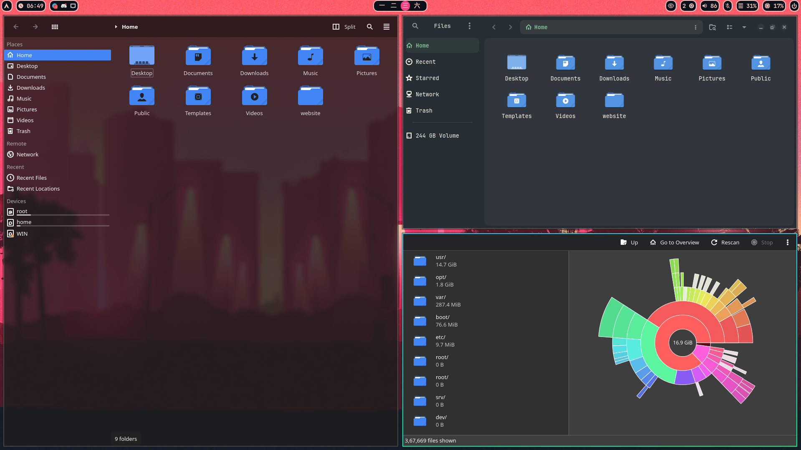

# GTK & QT Theming on Hyprland (Simple Guide)

This is a basic guide to make your apps look nice and consistent on Hyprland.

---



## 1. 📦 Apps You Need

`sudo pacman -S nwg-look qt5-wayland qt6-wayland qt5ct kvantum` 
`paru qt6ct-kde` 

### GTK:
- `nwg-look`

### QT:
- `qt5-wayland`
- `qt6-wayland`
- `qt5ct`
- `kvantum`
- `nwg-look`
- `qt6ct-kde`

---

## 2. 🎨 Themes Used

- **GTK Theme:** Everforest-Teal-Dark  
  [Download](https://www.gnome-look.org/p/1695467) or [GitHub](https://github.com/Fausto-Korpsvart/Everforest-GTK-Theme)

- **Cursor Theme:** Bibata-Modern-Ice (AUR)

- **Icon Theme:** Tela-circle-dark  
  [Download](https://www.pling.com/p/1359276/)

- **Kvantum Theme (QT):** OrchisDark  
  [Download](https://store.kde.org/p/1458909)

---

## 3. 📁 Where to Place Themes

- GTK themes → `/usr/share/themes/`  
- Cursor & Icon themes → `/usr/share/icons/`  
- Kvantum themes → Import in Kvantum Manager

---

## 4. ⚙️ Set These in Hyprland

In `~/.config/hypr/conf/environment.conf`:

```ini
env = GTK_THEME,Everforest-Teal-Dark
env = GTK_ICON_THEME,Tela-circle-dark
env = XCURSOR_THEME,Bibata-Modern-Ice
env = XCURSOR_SIZE,24
env = HYPRCURSOR_SIZE,24
env = QT_QPA_PLATFORMTHEME,qt5ct
env = QT_STYLE_OVERRIDE,kvantum
```
- QT envs are important, gtk can be used if some applications are not picking up the gtk theme

## 5. REBOOT
